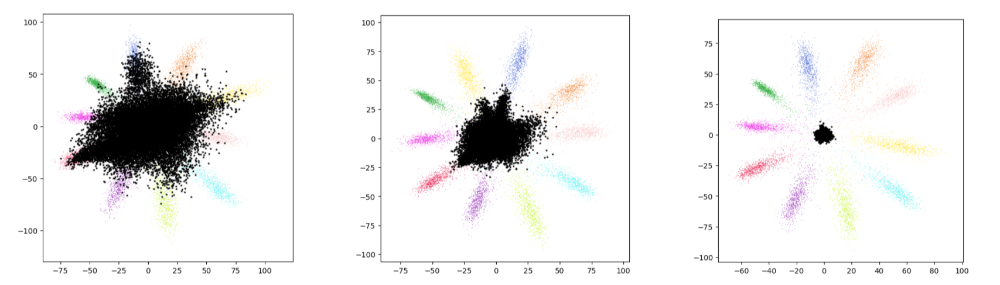

# Deep Adversarial Training for Teaching Networks to Reject Unknown Inputs [[PDF](https://github.com/shnippi/bachelor-thesis/blob/master/thesis/bachelor-thesis.pdf)]

## ABSTRACT

Modern day machine learning models are becoming omnipresent 
and are required to handle progressively more complex 
environments in their tasks. In classification problems, 
an increasingly popular scenario is called Open Set 
Recognition, which does not require the model to have 
complete knowledge of the world and during which unknown 
classes can be submitted to the algorithm while testing. 
This thesis tackles the challenge to correctly handle and 
reject these unknown inputs by performing adversarial 
training on our classification model. Furthermore, 
we analyze the difference in performance of several 
state-of-the-art adversarial attacks used in our 
adversarial training. The experiments show that our 
approach effectively deals with unknown inputs and 
delivers very promising results. To our knowledge, 
there has been no prior work that used adversarial 
training for Open Set Recognition like in our approach.

## Installation Guide

This Code runs on Pytorch 1.9.0 with Cuda 10.2. To be able to run the Code, please 
create a /data folder at the root directory of the 
project and add the needed datasets to it. You may also
create a /models and /plot directory. All high level settings
can be adjusted in the .env file.

## Implementation Details

batch size = 128  
epochs = 100  
iterations = 3  
learning rate = 0.01  
momentum = 0.9  
epsilon range = [0.1, 0.2, 0.3, 0.4, 0.5]  

## References

The implementation is based on Code from the 
[Vision and Security Technology Lab](https://github.com/Vastlab/vast)

### A bachelor thesis under the supervision of [Prof. Dr. Manuel Günther](https://github.com/siebenkopf)